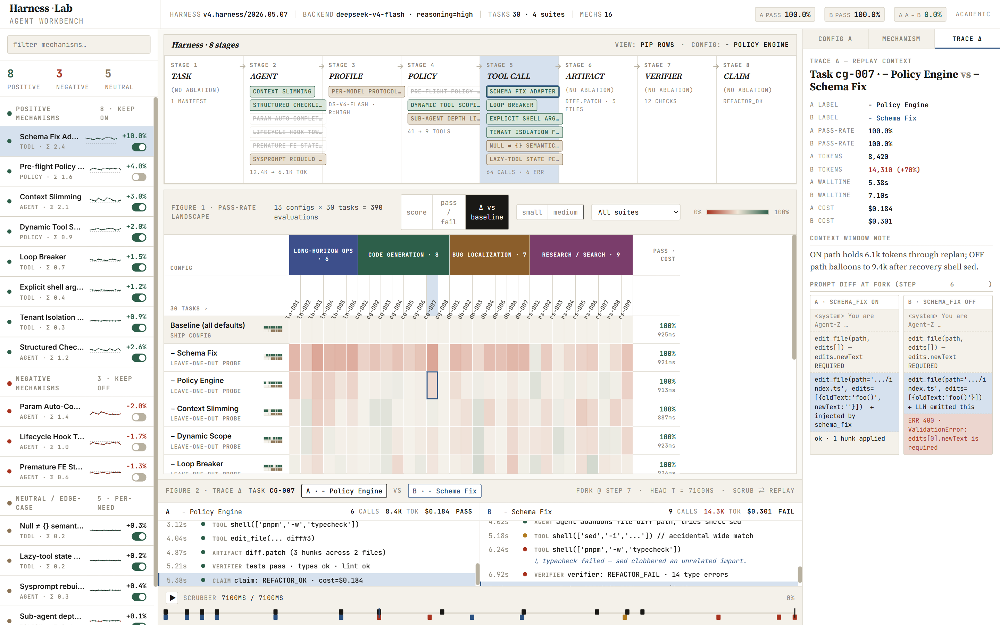

# Harness · Lab

An engineering workbench for agent harness.

> 中文版: [README.zh.md](README.zh.md)

---

## 1. Object of Study

The object of study is not a single language model, nor any particular agent application. It is the **agent harness**: a working system that brings together several otherwise independent parts — the model, its tools, the context it accumulates, the artifacts it produces, the verifiers that check those artifacts, and the policies that constrain its behaviour — under an explicit task objective, through declared strategies and feedback.

In current engineering practice, the model is often treated as a synonym for the whole agent. The model is in fact only one part of the system. The capability of the model does not directly imply the reliability of the agent, just as the output of an engine does not directly imply the reliability of a car. Calling this surrounding layer the **harness** is a way to make this neglected engineering object explicit, and to take it as the subject of systematic study.

## 2. The Problem

In deployed agent systems for office work, document review, and business process automation, the following phenomena have been observed repeatedly:

- Agents that pass demonstration runs cleanly begin to produce inconsistent results when run repeatedly on contract review, approval workflows, or office tasks.
- The same prompt produces noticeably different outputs across sessions, and across different prefix-cache hit states; an average pass rate over repeated runs often disagrees with the user's lived experience.
- When given a document to consult, the agent may still fabricate details that are not in the document, and then declare the task complete.
- Changing a single tool-call convention — without changing the model itself — can cause the entire main loop to stop converging.

In most of these cases, the cause is not in the prompt, and not in the model. Investing further effort in prompt iteration yields rapidly diminishing returns past a certain point. What actually determines whether an agent is stable is whether the layer around the model — the harness — has been treated as an engineering system.

## 3. A Working Prototype: One Empirical Run with GLM-5

The method behind this workbench is not proposed in the abstract. In an earlier debugging exercise on the τ³-airline customer service evaluation set released by Sierra Research, a set of engineering mechanisms was assembled around the model — narrowing the tool scope, repairing tool-call schema, asserting policy constraints before write operations, enforcing output rules — to constrain the behaviour of a GLM-5 model on that evaluation set.

The result observed in practice: under the same base model and the same baseline conditions, introducing this set of engineering mechanisms raised the pass rate by approximately ten percentage points over the baseline. **The mechanisms themselves did not modify the model weights, nor did they rely on toggling the model's own reasoning switch.**

This set of mechanisms is the early form that this workbench seeks to generalise: each mechanism addresses a distinct failure mode, can be independently switched off, independently measured, and independently compared with a baseline. The empirical run further suggests that isolating the layer around the model as an engineering object in its own right is a viable direction — not merely a proposition on paper.

## 4. Design Principles

In its early phase, this workbench does not optimise the language model's weights. What it does optimise is the layer around the model — the **harness policy**: model routing and escalation, tool-call conventions, context accumulation, artifact persistence, verification rules, safety controls. In practice this policy tends to appear as scattered switches, thresholds, prompt fragments, and ad-hoc scripts, without a unified representation and without a systematic way to evaluate or adjust them.

The task of the workbench is not to describe a particular agent that already exists. It is to provide, to engineers who design and optimise this class of agents, a method they can follow. To this end, the workbench must support four properties at once. These are taken in their control-theoretic sense, not as metaphor:

1. **Observability** — every step of every execution, the basis of every decision, and the origin and destination of every artifact, must be recorded and traceable.
2. **Controllability** — every mechanism must be independently switchable; any two configurations must admit comparison on the same task set.
3. **Stability** — the variation across repeated runs of the same configuration must be measurable; pass rates, costs, and trajectory drift must come with explicit variance and bounds.
4. **Closed-loop feedback** — the artifacts produced by each experiment must be admissible as input to the next, so that adjustments are not isolated events but evidence-bound iterations.

If any one of these four is absent, the workbench cannot serve as the basis for treating the harness as an engineering object. Among them, observability is prior: without complete trajectories and decision evidence, there is no object to control, no measure of stability, and no evidence on which to close the loop.

## 5. Current Form

The image below sets out the visual specification and information architecture of the workbench. It is a concept and a specification — not a screenshot of a deployed system.

The principal views of the workbench correspond as follows:

- The **top status bar** records the harness version, the model in use, its reasoning setting, the size of the task suite, and the overall pass rates of configurations A and B on the same task set.
- The **left panel** lists every mechanism involved in this evaluation. Mechanisms are grouped by their measured effect on the pass rate — positive (recommended on), negative (recommended off), neutral (situational). Every mechanism can be independently switched, and its contribution measured on its own.
- The **upper centre** presents the eight constituents of the harness: task, agent, model profile, policy, tool call, artifact, verifier, claim. Each carries the mechanisms that belong to it, giving a vertical anatomy of the harness.
- The **lower centre** is the pass-rate landscape. A baseline configuration, together with several leave-one-out probes — each disabling exactly one mechanism — is laid out across thirty tasks and four suites; the contribution of each mechanism is visible in this arrangement.
- The **right panel** is the trajectory-difference view. The execution traces of the same task under configurations A and B are aligned step by step from their point of divergence, so that prompt differences, tool-call differences, and verifier outcomes can be compared row by row.
- The **lower section** is the double trajectory timeline. The tool calls, artifacts, verifications, and claims of both configurations are placed on their actual time axis, and may be paused, replayed, and compared at any moment.

The workbench is at version v0, in the form of a concept and a specification. Its visual and informational architecture is in place; the component contracts, data schemas, and reference implementations are still being organised. The near-term goal of this repository is to document this specification. A directly installable runnable tool is not promised in the short term.

## 6. Relation to the Tutorial

The workbench takes on the engineering side. The corresponding methodology lives in an independent project.

- Tutorial project: [harness-study](https://github.com/li2092/harness-study) — *The Engineering Practice for AI Agents*.
- Workbench project (this repository): the specification of a workbench built on that methodology.

The division of labour is: the tutorial defines the object of study and the method; the workbench carries that method on executable instances. The readers of the tutorial include both human readers and the agent that will, on behalf of a non-technical user, deploy a harness in their stead. The users of the workbench include both engineers who tune a harness by hand and the automated tuning processes that take the workbench schema as their output format.

## 7. Near-Term Roadmap

The workbench is developed in four steps; each step depends on the stability of the one before.

- **M1 — Specification documented.** Every region, every information element, and every interaction in the workbench is reduced to a specification entry, with semantics, data source, and state space.
- **M2 — Data contract.** The data schemas of mechanism, configuration, task, suite, trajectory, and artifact are defined. Every execution shall be recorded in this schema, so that distinct implementations may be compared against one another.
- **M3 — Reference implementation.** A minimal runnable reference is connected to an existing agent execution environment, to verify that the specification is realisable.
- **M4 — Cross-implementation comparison.** The same specification is reused across distinct agent frameworks, so that the workbench is not bound to any one implementation.

## 8. Boundaries — What Is Not Done

The boundaries of the workbench must also be made explicit.

- **In the early phase, language model weights are not trained.** Optimisation on the model-weights side is retained for later planning.
- In the v0 phase, fully automatic harness evolution is not undertaken; any introduction or change of a mechanism must pass through an explicit, comparable controlled experiment.
- The workbench UI is not the single source of truth; execution logs, trajectories, and artifact records remain the source of truth, and the workbench is responsible only for presentation.
- No restricted source code is copied; for comparable external projects — such as publicly available agent orchestration frameworks — alignment is achieved only through their public interfaces, command-line surfaces, recorded outputs, and controlled experiments.

## 9. Audience

- Engineers and researchers in the course of constructing or tuning a particular agent harness.
- Product decision-makers who need to evaluate external agent vendors and form a judgement on the composition of those vendors' systems.
- Engineering teams building evaluation, tuning, replay, or observability tools who wish to reuse a common specification.

## 10. License

[Apache License 2.0](LICENSE) © 2026 Jinming Li

## 11. Contact

- Issues and Discussions are welcome.
- Email: li2092@qq.com
- See also: [GitHub @li2092](https://github.com/li2092)
