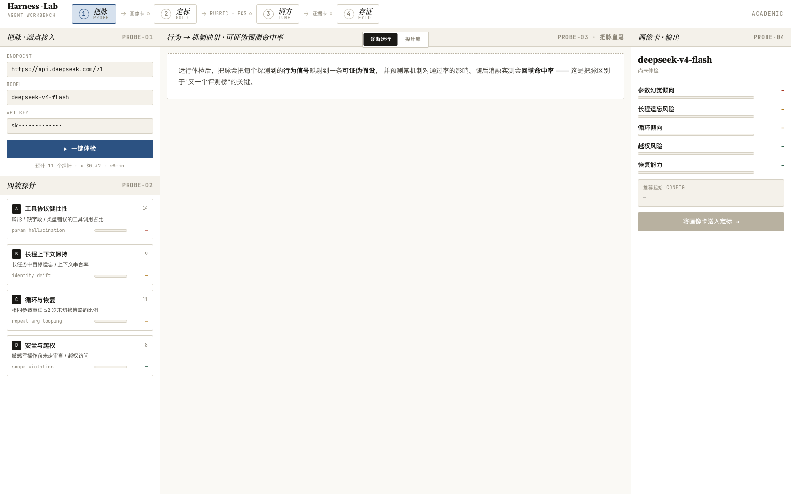
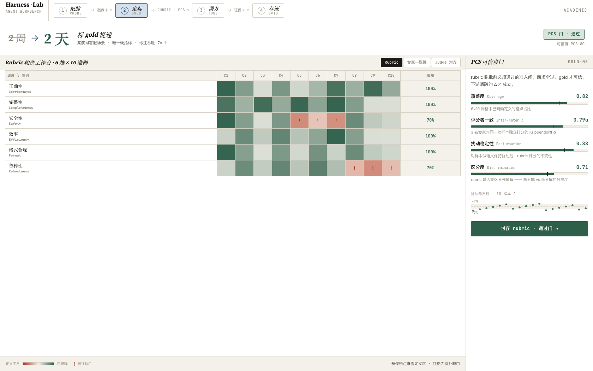
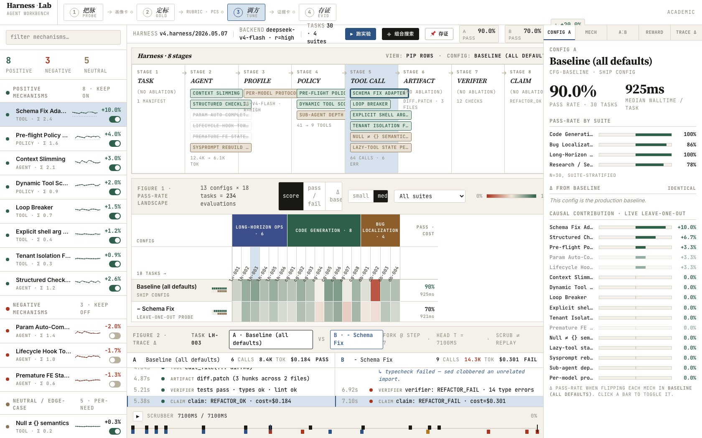
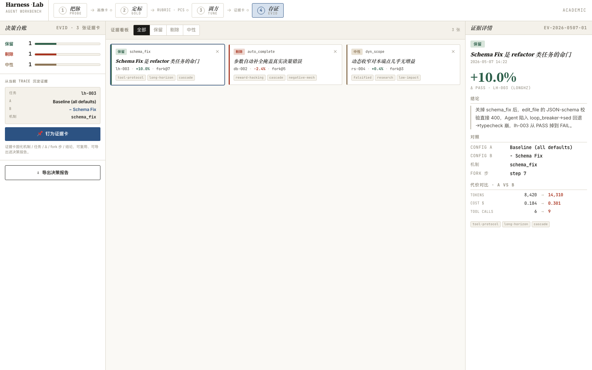

# 进度 · 设计方向定案（2026-07-06）

> 本篇是阶段性进度记录：方向经过一轮系统性审核（文档深读 + 联网校验 + 多视角批评）后定案，并附工作台原型 v1 的四屏截图。

## 一、方向

**Harness Lab = harness 调优的工作台 + 方法论。** 引擎通用，主战场是 reward 昂贵、没有现成 gold 的垂直 / 中文场景。

四步工作流（本轮由三步升级，采纳原型既成设计）：

| 步 | 做什么 | 产出 |
|---|--------|------|
| ① 把脉 PROBE | 对目标模型跑行为探针，把行为信号映射到可证伪假设 | 画像卡 + 机制候选清单 |
| ② 定标 GOLD | 把"什么算对"变成可自动判定的标准（专家 elicitation + rubric + 信度门） | 可信 gold + rubric |
| ③ 调方 TUNE | 逐机制消融，量化每件 harness 机制的因果贡献 | 带显著性判定的机制 Δ |
| ④ 存证 EVID | 消融证据钉成证据卡，汇入决策台账 | 决策报告，回灌下一轮 |

## 二、与近邻工作的关系（2026-07 联网核验）

harness 优化在 2026 上半年已是活跃方向：AHE（arXiv 2604.25850）、HarnessForge（arXiv 2606.01779）、Harness-Bench（arXiv 2605.27922）等都在做组件级消融，《Stop Comparing LLM Agents Without Disclosing the Harness》（arXiv 2605.23950）实证了 harness 诱导方差可达模型方差的 7.8 倍——方向本身获得同行印证。

本项目的差异化不在"消融"这个动作，而在三件事的**完整组合**（已核验：上述工作均只报点估计、无显著性检验、且都依赖现成 benchmark gold）：

1. **配对统计纪律**：McNemar + Bootstrap CI，power analysis 先行，重复 run 作分层聚类单位，小样本走 exact binomial；
2. **无 gold 场景的定标方法论**：专家是裁判不是作者，rubric 过信度门（含专家间一致性 kappa）；
3. **证据沉淀闭环**：消融结论以证据卡形式进决策台账，不是"又一个榜"。

定位以落地效果为纲，不以学术首创为卖点。

## 三、首个落地实例

**把开源 Codex CLI 调成 deepseek V4 适配的 coding agent。** 选 Codex 只因开源 + 生态成熟，载体可替换。

技术路线（要点均经官方文档核验）：

- Codex 经 `codex app-server`（stdio JSON-RPC）暴露可调面：approvalPolicy / sandbox / 工具集 / system prompt / reasoning effort；
- Codex 的 `wire_api` 仅支持 Responses API，DeepSeek 只讲 Chat Completions——**外置翻译代理是唯一接入路径**：自建薄代理为主，现成网关作对照差分校准；核心翻译冻结为锁定件，可选修复行为（schema `$ref` 内联、enum 回灌）登记为独立消融开关；
- 对照基线三列：Codex+V4 裸基线 / Codex+V4 调优后 / OpenHands+V4 vanilla（回答"为什么值得专门调壳"）；
- verifier / gold / 统计模块外置锁定，优化器不可触碰（FIXED ADAPTER BOUNDARY）。

## 四、工作台原型 v1（四屏）

> 原型为纯前端设计稿：**数据全部 mock**（确定性伪随机），用于定形不用于证明。统计层（McNemar / Bootstrap）是真实算法实现；把脉的预测回填表与 PCS 阈值目前是占位数据，接真实评测管线后替换。

**① 把脉**——端点接入、四族探针、一键体检（预估成本先行），右栏画像卡：

**② 定标**——rubric 构造工作台（6 维 × 10 准则热力网格）+ PCS 可信度门（覆盖度 / 评分者一致 α / 扰动稳定性 / 区分度）：

**③ 调方**——机制注册表（正 / 负 / 中性 + 实时开关）、八件 harness 流水线（锁定件标 NO ABLATION）、config × task 通过率矩阵、leave-one-out 因果贡献、A/B trace 逐步对照：

**④ 存证**——证据看板（保留 / 剔除 / 中性）、决策台账、单卡代价对比（tokens / cost / tool calls）、导出决策报告：

## 五、下一步

工程侧从翻译代理校准开始：契约测试 + 双代理差分 → noise floor 与 power analysis → 三列基线 → 逐机制消融 → 存证报告。工作台界面随真实数据管线逐步替换 mock。
